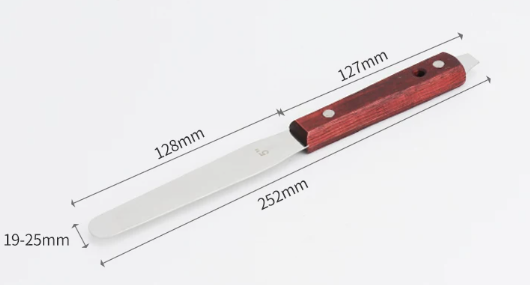

# 1. 办公环境配置
## 1.1. 需要准备的工具
大方向：高价格或低价格但大体积的东西，能共用的共用。低价格且小体积的东西，尽量人手一份，优先保证工作效率。
- 电脑
至少需要安装的软件：
- - keil：嵌入式开发工具
- - Altium Designer：硬件开发工具
- - multisim：电路仿真
- - solidworks：画特殊器件3D封装，根据外壳结构，核对PCB轮廓和接口位置；
- - 沟通软件，以行政部门为准；
- - VSCODE：有些参考代码keil打不开的用它来查看；
- - notepad++：代码开发助手；
- - Beyond Compare：代码开发助手；
- - 嘉立创EDA：常规零件的电子封装和3D封装可以从这里下载；
- - 嘉立创下单助手：下单PCB；
- - gitee：托管工程资料；
- - 任意claw：代码加备注和审核，原理图审核工具（2026年5月5日记录：此模式在肖爽处试运行中，待成熟后形成使用标准并向宋总汇报，确认可行性后试推行，必须由同领域的第三者做二次审核）。
- 万用表：每人一个；
- 防静电镊子：每人一个；
- 剥线钳：每人一个；
- 偏口钳：
- 螺丝刀套组：
- 游标卡尺：
- 烙铁：每人一个；
- 防静电手环：
- 胶枪：北京和新乡各一个；
- 示波器：北京和新乡各一个；
- 回流焊机：
- 洗板水：
- 洗板毛刷：
- 焊锡膏：
- 金属搅拌刀（焊锡膏），类似下图：

## 1.2. 培训流程
- 由老员工带领，熟悉标准，包含博创技术标准和工作标准；
- 由老员工带领，进行常规设备和软件的安装、使用的培训；
- 由老员工带领熟悉老项目：选择典型的老项目，熟悉代码和电子资料，例如以2026年新入职员工为准，可以熟悉卓越之星，创意之星，智元素的代码和电子资料；
- 由宋总安排，先从老产品的维护开始着手工作，例如老项目需要优化的地方，需要设计的工装等；
- 由宋总安排，从零碎的小工作开始，慢慢接手一些可以独立完成的开发项目，期间由同领域老员工审核。

