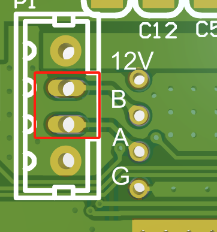
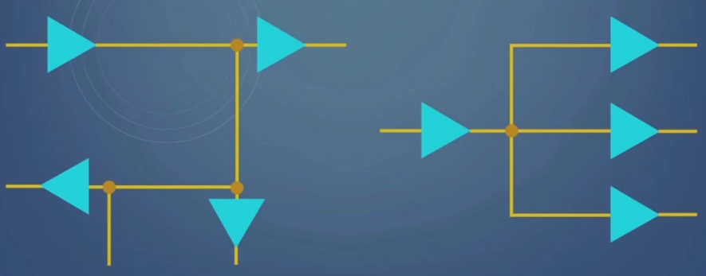
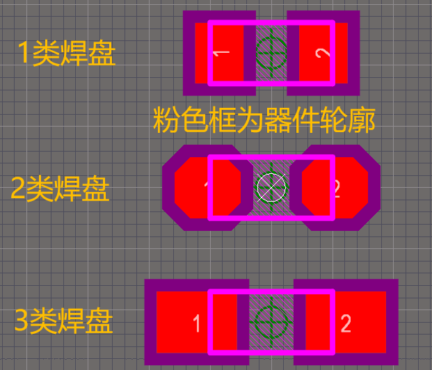

# 1. 前提

此标准库的用于研发经验的积累与传承，避免项目在同一个坑上绊倒多次，并让公司产品一代比一代更加可靠和具备竞争力，且有助于公司新员工快速了解产品具备哪些要求。
# 2. 资料整理
这里将资料整理环节放到开头，因为资料整理工作极为重要，一家公司如果不注重资料管理，在人员变更时，业务往往会受到很大的冲击。因为后人可能需要花费大量时间精力追溯产品具体是什么样的，才便于维护此项目，并对一些功能细节进行优化，使产品更加稳定和具有竞争力。
按顺序：
- 讨论产品大致功能轮廓
- 整理产品方案
- 规划产品框架
- 规划产品功能流程
- 研发各环节落实
- 规划检测工装
- 整理研发与生产归档资料
- 回顾以上过程，优化标准库

## 2.1. 标准库整理
标准库的目的在于指导开发人员工作，而非限制开发人员思维。因此可有可无的内容尽量避免出现在库中，每一条都应写清意义，以便开发人员判断是否适用于正在开发的产品上，并便于在设计新产品或技术迭代时判断如何对旧标准同步更新。
## 2.2. 研发资料整理
研发资料的整理见模板。
## 2.3. 生产资料整理
交付生产的资料应用通俗易懂的语言描述，对于产品检测，应尽量避免在检测结束前出现成功或失败等状态，避免生产误判，导致在检测结束前人为干涉检测过程。成功或失败等描述只能出现在检测结果中。
# 3. 标准库
## 3.1. 产品管理
### 3.1.1. 产品设计需求
设计项目前，咨询各环节负责人，明确本次产品的应用场景具体有哪些，并在汇总后形成需求文档发给对应负责人审核，确认无误后，再开始设计产品。

## 3.2. 电路设计标准
### 3.2.1. 编程口设计
编程口至少需要SWDIO、SWCLK、GND三个引脚，但生产更习惯将所有PCBA下载好程序后再进入测试环节。为了生产下载程序更加方便，应增加VCC引脚在SWDIO左侧。而有时产品需要做深度睡眠模式管理来降低产品整机功耗，因此应在VCC左侧增加RST引脚，便于从深度睡眠模式唤醒单片机，因为深度睡眠模式无法进行程序下载操作，必须先硬复位单片机才行。
因此编程口定为RST、VCC、SWDIO、SWCLK、GND。
### 3.2.2. 元器件封装
元器件封装应对生产人员友好。在设计高速产品时可以使用0402及更小的封装，常规产品应使用0603及更大的封装。尽量选择引脚外露的器件。
封装越大生产加工难度和产品不良率越低，引脚外露便于焊接后观察焊接质量，减小维修重焊难度。
### 3.2.3. 电气参数
应用新的电路时，要用示波器监控一下耦合到信号上的杂波是否超过元器件电气参数上下限。
### 3.2.4. 静电防护
插座排针或焊盘较大且容易被手碰到的线路应考虑静电防护。对于电源类，应用钳位电压低一些，静电泄放功率高一些的TVS管，对于信号引脚，可以使用结电容小一些，能保证信号质量的ESD管。
### 3.2.5. 螺丝孔
信号线与螺丝孔的距离应大于螺丝帽或螺母的半径，避免拧螺丝时阻焊层磨损露出金属，引起短路问题。可以从keep-out层在螺丝孔处画个圆圈，圆圈半径大于螺丝帽或螺母半径。
### 3.2.6. 正负片工艺
画多层板时，尽量避免使用负片，因为负片的加工工艺不如正片可靠。按嘉立创的意思负片工艺是厂家偷工减料节约成本的做法，非常抵制负片工艺。

### 3.2.7. 射频干扰
产品包含射频部分时，应让信号线远离天线。关键信号线应有完整的地线进行包围。如受布局影响必须靠近天线，应加粗此处信号线以降低干扰程度。射频信号耦合到信号线上后，容易导致信号波动范围超过元件电参数上下限（一般是超过下限），引起元件复位或死机。

### 3.2.8. 插座类元件
如果引脚间距较小，建议中间的几个焊盘使用下图所示的椭圆焊盘，避免受锡渣影响导致短路。

 

### 3.2.9. 高速信号质量控制
 - 在信号频率较高时，差分类信号线长差异不要太大，避免影响数据稳定性，一般不应超过5mil；
- 用多层板画高速信号线时，高速信号尽量使用带状线，保证阻抗的一致性；
- 同一层画多条高速信号线时，注意保持线宽2~3倍以上的间距，以避免串扰；
- 高速信号要有完整的参考层来避免信号反射。
- 尽量减少高速信号线经过过孔的次数，因为过孔等效于一个小电容，会减缓信号上升沿下降沿幅度，导致信号失真，尽量减小过孔stub长度以减小信号反射程度；
- 高速信号过孔应在附近加一个地孔做信号回流区域，减小阻抗变化和反射带来的影响；
- 高速信号应让PCB厂家加工时做阻抗控制，以保证理论值和实际加工值偏差尽可能小；
- 高速差分信号线做等长处理时，两根线的距离不可太大，避免差分阻抗出现大的波动；
- 高速信号线计算等长时，应包含主芯片内部引脚长度，一般可以从芯片公司开放的资料中获取到；
- 高速差分信号线如有等长要求，那么等长的处理越早越好，例如能在信号线起始端画等长线，就避免在终端画等长线；
- 不同组间高速信号线一般应有包地处理，包地线每隔一段距离加一个GND孔；
- 高速信号线注意不同信号组之间的信号等长控制，等长规则可以上网搜索到；
- 受到成本控制或元器件密度限制，一些电源或信号线不得不经过高速信号参考平面，导致高速信号线的参考平面不完整时，尽量选择从速度低一些的信号参考平面经过；
- 高速信号线经过ESD管或者上拉下拉电阻时，应减小走线stub长度；
- 为保证高速信号阻抗一致性，应在走线宽度突变的地区，例如焊盘区域，进行隔层参考，也就是将相邻参考层做挖空处理；
  
### 3.2.10. 低功耗产品
为降低单片机引脚漏电流：
- 没有接外围电路的单片机引脚，应避免处于悬空状态，一般建议配置成输出低（或遵循单片机手册进行配置）；
- 比如一个型号的单片机使用的内核，预留接口为144pin，而咱们使用的单片机只引出了64pin，对于缺少的那80pin，也应进行配置（或遵循单片机手册进行配置）。
  
### 3.2.11. 接插件位置
- 接插件应靠近板边放置，伸出板边的长度控制在2mm左右，以便做外壳时既不会影响插拔操作，也不会伸出外壳太多；
- 当线路板包含多个立式插座时，尽量选择高度相差不大的插座，一是封装外壳时会更加美观，二是插座高低差较大，较低的插座插拔插头时手感不好；
- 立式接插件应靠近线路板角落或板边放置，如情况特殊不能放到板边，应做受力分析，让电源线避开弯曲严重的区域。避免大力插拔引起线路板弯曲时损伤电源走线，电源线受损会增加此区域的电阻，此处长时间过大电流会烧坏PCB板；
- 接插件焊盘与其它焊盘的距离尽量大于5mm，以保证焊接便捷性，减小锡渣的影响，因为接插件一般是手工焊接的，手工焊接容易留下大量锡渣；
  
### 3.2.12. 板边距控制
线或焊盘离边至少保持0.5mm（20mil）间距，避免切割线路板时损坏信号线。如果使用邮票孔拼板，信号线与邮票孔同样需要保证足够的距离。

### 3.2.13. 原理图标注规范（非强制要求）
- 根据DCDC输出电压，结合芯片手册和分压电阻的误差范围，标出默认输出电压及实际输出电压的所在区间，如“4.85~5.25V，默认5V”；
- 对电气参数有特殊要求的元件，例如对功耗或电流要求较高，应在元件旁添加相应标注，如“PMIN=1.5W”；
  
### 3.2.14. PCB标注规范
线路板应预留足够的空间来放置公司logo、PCB版本号、设计人和设计日期。

### 3.2.15. 高速信号接多负载时的处理
当驱动器的高速信号输出端同时接多个负载时，可以通过下图的两种方式接线，左面为菊花链型，右侧为星型。这样有利于避免各负载相互干扰。

 

### 3.2.16. 产品设计模式
 - 公司产品售价较贵，应优先保证产品质量，对于电路防护措施，应尽可能全面，避免为了节省几毛几分钱导致产品出现可靠性差的问题；
- 公司产品功耗较大，追求通讯的实时性，无需考虑低功耗管理例如深度睡眠模式和待机模式等，也无需考虑低功耗单片机或电源芯片，优先考虑运行速度高且供电能力可靠的芯片；
- 公司产品出货量较小，但种类较多，设计生产检测工装时，尽量保证工装体积小，通用性高。

### 3.2.17. 锂电池充电管理
锂电池充电应针对每一节锂电池做充放电管理，也就是平衡充，因为各个电池的初始电量可能不同，如果不做平衡充会导致有的电池过充或过放。
## 3.3. 元器件选型标准
### 3.3.1. 普遍性
所选的元器件应为被广泛使用验证过的器件，尽量选大厂推出的器件，尽量少使用冷门、偏门芯片，减少开发风险。
### 3.3.2. 高性价比
在功能、性能、使用率都相近的情况下，尽量选择价格便宜的元器件，降低成本。
### 3.3.3. 采购方便
尽量选择容易买到、供货周期短的元器件。
### 3.3.4. 持续发展
尽量选择在可预见的时间内不会停产的元器件,禁止选用停产的器件,优选生命周期处于成长期、成熟期的器件。
### 3.3.5. 向上兼容
尽量选择以前老产品用过的元器件，一来公司可以单次采购多一些，二来以前的器件经过了市场的检验，可靠性更高。在性能不足，成本相差较大，体积不合适等不适用于新项目的情况下再选择新器件。
为了便于后人查找器件，登记新器件到元件库中时，要标注器件类型与型号封装等参数。例如名称：运算放大器XXXX，封装XXXX等。
### 3.3.6. 电参数
结合信号干扰时耦合到电压或信号上的纹波，器件老化后性能的衰减，器件本身存在的工艺误差等因素，针对器件耐压建议降额20%以上使用，针对输出电流和功率，建议降额10%以上使用。
### 3.3.7. 电源芯片
电源芯片选型时，尽量选择输入电压高一些的，避免脉冲浪涌叠加在电源输入端损坏芯片。虽然类似情况可以通过TVS管进行防护，但输入电压高一些的电源芯片价格最多贵几毛几分钱，双重防护安全性更高。
### 3.3.8. 转接线
选转接线时注意接口定义是不是颠倒的。比如USB转4pin，就存在两种颠倒的线序，很可能选错了。
## 3.4. 嵌入式开发标准
### 3.4.1. 程序版本识别
应有办法直观地判断产品使用的程序版本，例如在液晶屏的角落增加版本号，或利用LED灯的闪烁规则表示版本号。
### 3.4.2. 任务实时性
- 当程序为多任务同时运行的模式时，尽量避免使用堵塞延时。
- 中断函数中应尽量少放入耗时较长的函数，尽量只在中断中做标志和基础函数的管理。
### 3.4.3. 数据传输速度
数据传输速度应结合业务场景、通讯频率和单包指令最长字节数，以尽量低的速度为准。数据收发速度越低，信号稳定性越高，产生的辐射越小，抗干扰能力越强，对其它线路的干扰越小。
### 3.4.4. 单片机初始化配置
单片机初始化后，应先延时50~100ms后再进行硬件初始化。比如电路配置单片机3.3V供电，但刚通电时，可能电压升到2点几V单片机就开始运行，此时外部电路或单片机状态可能不太稳定，因此最好延时一段时间再做硬件初始化工作。
### 3.4.5. 看门狗
一个完整的单片机工程（给学生们的例程代码除外）最好配置看门狗功能，以便单片机受干扰导致死机时能自动复位。
### 3.4.6. 写flash/EEPROM
写flash或EEPROM时，应关闭所有中断，在写入成功后打开中断。如此时进行串口收发，应在写完flash或EEPROM后再进行响应。（确认是否写入成功，除了判断库函数标志外，可以增加一个校验区，写入前对参数进行校验，写入后读出来再次校验，如两次校验码相同说明写入成功）
历史问题记录：CD5516舵机程序，发指令写EEPROM，在写入结束前就返回了响应指令，串口和写EEPROM操作赶在一起导致单片机复位了。
# 4. 生产便捷性管理标准
## 4.1. 外接设备
### 4.1.1. 默认接线方式
外接设备默认使用插头插座形式，便于产品售后管理。如产品出问题，需要老师学生动手更换某个零配件，插头插座的形式会更友好，如果是焊线方式会导致可操作性变差。
### 4.1.2. 同样pin数外设连接方式
不同的外接设备：

- 如果电源电压不同，避免使用相同的插头插座，避免插混导致器件受损。

- 如果电源电压相同，且评估后判断相互混插不会导致器件受损，可以使用同一种类型的插座，以减少插座种类，减轻采购和生产管理压力。只需在PCB丝印上做好标识，在生产检测上做好规划即可。

### 4.1.3. 插座选型
优先选用直插或立贴的类型，因为弯插或者卧贴会导致插拔时插座翘起来。如插座与元器件在同一面，可以使用立贴的方式。如不在同一面，可以使用直插的方式。

### 4.1.4. 拼板
#### 4.1.4.1. 工艺边
拼板时，无论是手动贴片，还是SMT贴片，都需要增加工艺边，SMT贴片无需多言，手动贴片也需要是因为手拿板子时有个放手指的地方，避免手指碰到元器件。
且拼板时，板子不要拼的太高，因为太高的话手贴上面的板子时容易误碰下面的器件，且也手也容易酸导致贴片质量下降。
#### 4.1.4.2. 拼板方向
拼板时保持一个方向拼板，以便找到一个器件的位置时，所有板子贴片都方便。
曾经我想用一种2×2的拼板，上下2个板子的方向颠倒，以便贴完下面的2个板子后，拼板颠倒180°贴另外2个板子，来避免4个板子同一方向时板子太高导致贴上面板子时手酸且误碰下面的器件的问题，也就是分2次贴两个板子。但咨询生产意见，还是倾向所有板子都是一个方向，便于同时贴片4个板子。

## 4.2. 贴片管理
### 4.2.1. 焊盘管理
焊接有手动焊接、钢网焊接两种，钢网焊接又分SMT机贴和人工贴片两种。
公司目前主要通过钢网人工贴片，通过焊锡膏和回流焊进行焊接。下图为阻容件焊盘：
- 1类焊盘为钢网焊接主流的焊盘，焊盘面积与器件轮廓贴近，减少“部分焊盘区域未利用到，焊锡膏在此区域容易产生锡渣”的情况。但这种焊盘面积较小，可能会导致人工刷焊锡膏时部分焊盘焊锡膏较小，或在元器件贴歪时器件虚焊的情况。
- 3类焊盘为人工用烙铁焊接时常用的焊盘，特点为焊盘凸出器件轮廓许多，便于烙铁上锡，且烙铁温度高，锡渣都会被烙铁带走或融化贴合在焊盘上，不容易产生锡渣（但烙铁拖动时可能会在焊盘边的阻焊层留下锡渣，这与焊接人员能力有关）。但用于钢网焊接时，因为很大一部分区域裸漏，导致产生大量锡渣。
- 因此综合考虑，后期阻容件使用2类焊盘，既能增大焊盘面积，又能避免裸漏焊盘面积过多引起大量锡渣问题。焊盘两边的凸起目的在于使焊锡膏更贴近元器件中心区域，避免四角残留过多锡渣。 
 

## 4.3. 生产维修
### 4.3.1. 丝印图
- 导出丝印图时，将线路板正反面走线图也导出来，这样便于生产排查问题。如果使用的开发工具为AD的话，将GND铜皮隐藏后再导丝印图，否则走线层会覆盖器件符号。
- 除非结构上有需要，否则板子统一按绿色阻焊层执行，因为绿色阻焊层周期快，板子上走线清晰，生产检查故障板时更方便。

# 5. 工装设计标准
## 5.1. 不同生产数量产品工装设计模式
- 产品数量较少时，工装设计可以简单些。但如果产品数量较多，可以采用拼板模式，一次性检测多个，且检测方式以检测人员按下按键，工装直接提示检测结果即可，尽量简化操作人员的干预。
  
## 5.2. 电源检测模式设计
 对于电源类，既要测试电压值，也要保证输出电流足够。对于电压，可以通过ADC进行精确检测，或者12V-电阻-LED-7.6V-电阻-LED-5V-电阻-LED-3.3V-电阻-LED-GND的方式进行粗略检测，只是要保证电阻阻值足够大，让LED微微亮就可以了，避免上级电压过多叠加在下级电压上。对于检测输出电流，可以利用大功率电阻的方式。

## 5.3. 检测结果提示模式
在检测结束之前，不要以任何形式出现“成功”或“失败”之类的状态，检测人员可能会误以为检测结束，从而人为提前结束检测。如果需要展示检测过程，可以以检测序号或“正在发XX指令，请等待”、“XX指令发送结果为0，正在重发，请等待”、“XX指令发送结果为1，准备发YY指令”之类的进行提示。

## 5.4. 生产复测
产品检测通过或未通过，都可能需要进行复测。而产品测试过程中有可能会改变一些参数，导致复测时因这些参数的变化导致复测时卡在某个流程，因此需要规划产品测试过程中一些参数被改变的状态下，如何完整对产品进行测试。

## 5.5. 生产检测说明
- 早期生产检测说明是根据产品可能出现的问题，倒推可能是哪些区域出现问题，再发给生产做故障品的排查依据。但这样可能会有遗漏，导致生产被卡住很长时间进行排查。因此如果整理资料的时间比较充裕，可以考虑在原理图上标注每个器件型号焊错或虚焊短路能产生什么影响。只标注容易出问题的器件即可，例如有方向的器件方向焊反，引脚间距小的器件引脚短路，电阻阻值焊错等容易出错的器件，在出错后会带来哪些异常现象。

- 整理生产使用说明时，对于一些解释类的文字尽量省略，留下具体操作说明即可，如有必要进行内容解释可以在括号中加以说明。

- 针对生产操作说明需要附上图片的情况，最好在每段话下附上与此有关的图片，比如两个工艺说明，在最后附上一张大图，不如在每个工艺说明下各附上一张小图更友好。

## 5.6. 生产操作便捷性指导说明
- 生产进行焊接时，拿到的最好是最终成品。例如接插件，如果需要弯曲焊接，但来料排针是直的，可以设计个工装，由单一工站统一弯曲处理，弯曲的距离和程度在工装上做好一致性处理，然后拿到焊接环节直接焊接。

# 6. 外观管理
## 6.1. PCB外观
有些客户会对外宣传产品是他们做的，此时产品如果外露出其它公司的logo会很麻烦，因此产品设计时，尽量不要体现出公司logo。如有必要，可以考虑使用贴纸，有需要时还能揭下来。

# 7. 物料登记
## 7.1. 命名规则
- 物料命名时应照顾后来的工程师，便于后来的工程师看一眼就明白这是什么器件，比如电阻电容等一眼就能看出来的命名时简化些没关系，但一些特殊芯片或元件应在具体型号前写明这是什么器件，比如单路运放ABCD，火焰红外检测传感器EFGH等。
- 优先以行业标准进行命名，如无行业标准可将具体外形轮廓尺寸等信息简化后加到名字中，以便快速识别。
- 名字长度不宜过长，否则录入ERP系统时可能会失败，不超过30个字一般没问题。
- 命名时避免两个不同属性的数字挨在一起，中间尽量用字母或文字等隔开（一般数字都带单位或运算符，因此问题不大）。主要是数字不要放在名称开头，因为会与物料编号连在一起，比如01.234.567 4VXX可充电锂电池，尽管7和4之间存在空格，但也容易被看成7.4V锂电池。
- 比如淘宝上搜索到的器件，命名时不要直接用淘宝店铺起的名字，淘宝店铺为了增加搜索量在命名上会比较冗余，要根据具体物品自己规划应该怎么命名。

# 8. 结构设计
## 8.1. 外壳
### 8.1.1. 锂电池外壳
锂电池外壳设计时，投影到锂电池上的螺丝孔不可用通孔，否则一旦用长螺丝，拧螺丝时容易穿透电池外皮，引起着火问题。

# 9. 维护便捷性
## 9.1. 工程
- 能整合到一个PCBA的尽量整合到一个PCBA上；
- 能整合成一套协议的整合到一套协议上；
- 能一条指令实现多个功能的以一条指令为准（例如读指令，能通过读命令搭配读取长度来一次性读取ABC三个参数的话，比ABC分别用三条指令依次读更方便。写指令也一样，能一条指令一次性向多个设备写命令，例如ID1+参数+ID2+参数+ID3+参数这样，胜过用三个指令分别向ID1、2、3来写参数）。但命令不可太长，尤其是无线命令，命令长度越长，指令误码率越高，无线通讯时失败率越高；
- 协议中出现的参数应为带着标准单位的通用参数，不应以代码中的过程变量为准；
- 能一套代码通过宏定义实现bootloader工程的boot代码和APP代码的整合成一套代码；
- 能一个上位机软件实现多个产品功能的（例如下拉列表每项对应一款软件功能）整合到一个上位机软件上；
- 能用一个流程图文件表示的，避免用多个流程图来表示。
# 10. 成本控制
- 肉眼可见耳朵能听到的地方，例如屏幕大小、速度、稳定性、力矩、音质等可以尽可能堆成本，以增加产品表现力；
  
# 11. 容易出错的邮件与审批涉及人员
## 11.1. 邮件
- 25.10.28，与库房管理员王娟语音沟通确认，研发阶段申请新增物料和产品编码时，也要抄送生产经理；
## 11.2. 审批
- 25.06.30，与生产经理张朋朋沟通，从生产领用或借用东西，审批中无需添加生产经理。