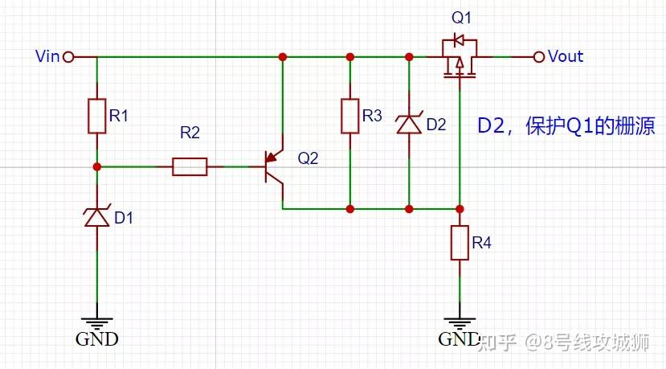
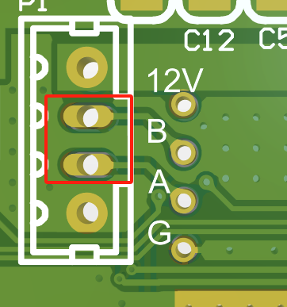
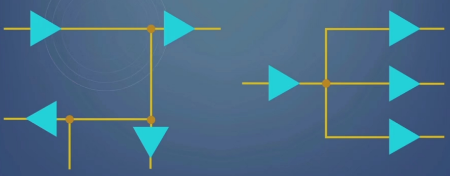
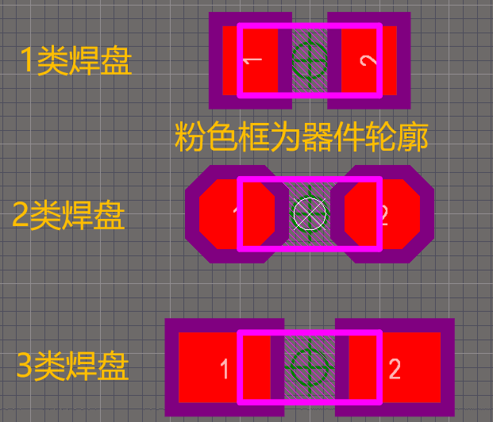

# 1. 前提

此标准库的用于研发经验的积累与传承，避免项目在同一个坑上绊倒多次，并让公司产品一代比一代更加可靠和具备竞争力，且有助于公司新员工快速了解产品具备哪些要求。

标准的整理需要团队每个人都具备很大的格局，因为掌握一个领域的知识很容易，只要勤奋好学即可，而将知识应用在市场上很难，需要长期在市场摸爬滚打总结出经验才行。而将这些经验形成标准后，新人直接汲取前人的经验，新员工很容易就能替代老员工，对于心胸狭隘的人是坏事，对于心胸宽广的人来说是好事。

古代皇帝，希望所有人都能力平庸才便于管理，但会导致团队变弱，容易被外敌侵犯。而强有力的领导者会让团队每个人都日复一日地变强，再通过管理经验让团队凝聚起来，这样形成了竞争力很强的团队，每个人都能从中受益。

标准的建立可以让每个人都能更加专心于研发新的项目，因为可以避免让无穷无尽的产品生产和售后问题打扰自己，也能让其它部门更加轻松。

## 1.1. 标准库整理
标准库的目的在于指导开发人员工作，而非限制开发人员思维。可有可无的内容尽量避免出现在标准库中。

每一条都应写清意义，以便开发人员判断是否适用于正在开发的产品上，并便于在设计新产品或技术迭代时判断如何对旧标准同步更新。如果知道原理，只要能有办法实现目的，那么就可以不用遵循标准，如果不了解底层原理，那么按标准执行准没错。例如：
- USB信号一般应遵循90Ω阻抗，如果遇到板子空间的限制导致某一块走线区域无法遵循此标准，不懂得底层原理的人只知道不遵守阻抗会有问题，因此会增加板子层数增加产品成本来解决问题，最终成品肯定没问题。而懂底层原理的人就可以判断这个走线区域不执行90Ω阻抗匹配会有多大影响，可能不增加板子层数也能解决问题；
- 一般接口需要考虑增加静电防护，不懂得底层原理的话，加上静电防护准没错。但懂得静电冲击的路径和来源，以及静电冲击的区域和传导路径，就可以判断某些地方是否没必要加静电防护。

因此以下标准，可能结合大家以前的产品使用场景，觉得不符合以下标准也没出过问题，但懂得原理的话，就能知道有些场景确实没有相关需求，不遵守以下标准也没事，但换一个使用场景，就需要重新审视这些标准了。
## 1.2. 研发资料整理
### 1.2.1. 文件夹模板
- 25.12.22，与宋总郭工讨论，确定文件夹归档模板为“大项目——料号 名称PCBA版本——子文件夹”的形式，版本/料号变更时在项目文件夹下新建一个“新料号 名称PCBA新版本”文件夹。
之前讨论旧模式：PCBA文件夹名称这里不体现料号和版本，在PCBA子文件夹中体现料号和版本，这样哪个子文件夹变了就改哪个子文件夹即可，此模式25.12.22开始作废。
- 2026年开始计划落实下面两件事，需要循序渐进：
- - 向库房负责人申请登记产品料号和名称时，名称中不要体现出版本号。版本号体现在研发资料中即可。以前产品的管理，举例来说：就像户籍部门登记身份证号和姓名，小明的衣服换了，戴眼镜了等，每次变更，小明的名字都变为小明1.0，小明1.1，然后每次都向户籍部门申请变更名称并重新分配身份证号，这样操作是有问题的。版本变更通过版本号来区分是对的，但不应每次变更都向库房申请重新分配编号和名称。因此产品设计完，库房登记的产品名称就是“小明”，而非“小明1.0”。这个版本号可以体现在屏幕、LED灯的闪烁次数或频率，蜂鸣器响声、线路板丝印、归档文件夹名称、独立的文档、代码的main文件开头等区域，只要有办法能让自己和生产及采购人员区分即可。
- - 比如一个产品包含了一些小模块，小模块内包含了PCBA，PCBA由PCB和很多器件组成，而这个小模块或PCBA可能很多产品在调用。以前小模块或PCBA或PCB变更后，每个用到它的上级BOM都要重新分配名称和编号，然后一级级往上变更，就像员工的椅子挪个位置，一级级往上变更，最后公司要到工商部门重新登记一样。这是不合理的，后期产品变更时，上级BOM无需变更。
### 1.2.2. 方案整理
一个产品的研发资料尽量整理到一个文档上，假如一个产品涉及到多款单片机，多个协议，在一个文档中整理好即可。文档越多越容易乱，人员更迭时越容易出问题。

# 2. 项目模板
## 2.1. 生产资料整理
### 2.1.1. 方向
交付生产的资料应使用通俗易懂的语言描述，对于产品检测，应尽量避免在检测结束前出现成功或失败等状态提示，避免还没检测完生产人员就误判检测结束了，使得生产人员人为中断检测过程。

成功或失败等字眼或状态描述只能出现在检测结果中。
### 2.1.2. BOM
#### 2.1.2.1. 辅料与工具
产品使用过程中，如果用到了一些胶带和工具对产品进行辅助加工，例如用螺丝刀拧螺丝，或者某个环节需要在天线上粘个胶带起到固定作用，或者需要胶枪打胶固定零件，这些零部件按“辅料”和“工具”走，无需进入BOM清单，只在SOP中体现即可。

# 3. 标准工程库
不同行业有不同的工程模式，每个人都有各自的工作风格，每个人成长的历程不同，在某个分支领域的经验参差不齐，作为团队应整合每个人的优势，弥补各自的劣势，形成专属工程库。避免每次老人一走，新人入职后一切都从头再来。

有了工程库，一来新人可以直接调用现成的模板和接口，有利于新人快速接手老项目维护与新项目开发工作，二来可以节约项目开发时间，三来能避免同一个功能代码、电子元件、机械器件，每换一个开发人员，就重新编写或选型一次，最终导致产品品质良莠不齐。

无论是资料、算法、前端、后端、嵌入式、电子还是机械类，都是可以模块化并日积月累逐渐优化的，确保产品开发的越多，新产品可靠性越高。可以多研究研究国家标准或某些大型企业总结出的企业标准。

## 3.1. 代码类工程库
### 3.1.1. 上位机模板
应将各种接口代码进行模块化和抽象化，以便进行调用，不同功能用到的标志应尽量整合到独立的枚举或结构体等位置，不同应用逻辑或通讯接口应封装好，应将接口的函数名、函数功能、输入参数、返回参数写明，避免意思模棱两可。比如用到了一个字节的每一位，那就应说明每一位的作用，而非简单描述这个字节的作用。

输入参数应考虑是否配置上下限，因为其它人与自己搭配时，有可能会使用不合理的数值。
### 3.1.2. 嵌入式模板
应分为软件层和硬件层两部分：
- 软件层也可以称为应用层，应与硬件层区分开，变更硬件时，软件层应可以直接移植到新的硬件平台才对。
- 硬件层也可以称为驱动层，整合芯片接口方面的代码，切换芯片进行开发时，无论是切换单片机，还是存储芯片等，需要修改的只有硬件层代码，不应牵扯到软件层代码。
## 3.2. 通用电子器件库
每个使用的电子器件都应经过品牌可靠性筛选，确保可以持续供货且品质可靠，比如过大电流、高频信号类器件，选型后应进行高低温实验，一来确保参数没有严重虚标，二来确保器件性能的一致性。

很多小厂会将器件参数虚标，或器件性能的一致性差，有时前几批供应的器件还算可靠，但换个生产地或原材料，新的批次器件品质就开始出问题了。

经过筛选的器件，应进入通用零件库中，以便新来的工程师可以直接调用这些可靠的器件，避免同一个硬件功能用了一堆不同的器件，采购和生产管理压力会增大，且难以批量采购备货。
## 3.3. 通用机械零件库
一些通用性高的零部件，应经过品牌可靠性筛选，确保可以持续供货且品质可靠，选型后应采购一批，根据使用场景，进行尺寸一致性对比、抗弯折实验等。

由于机械器件可能存在不同批次一致性差的问题，只要确定下某些零部件的通用机械零件库，就可以大批量囤货，每次来料都可以进行抽检。如果没有建立起通用机械零件库，那么不利于囤货，只能一次买一小批，然后口头上表示需要进行来料检验，但对进行来料检验的负责人来说压力过大，最终是否真的检验，或检验过程是否标准，是难以保障的。
# 4. 开发标准库
## 4.1. 产品管理
### 4.1.1. 产品设计需求
设计项目前，咨询各环节负责人，明确本次产品的应用场景具体有哪些，并在汇总后形成需求文档发给对应负责人审核，确认无误后，再开始设计产品。
## 4.2. 多环节配合标准
产品开发设计到多个环节相互配合时，一定要虚心听取他人意见，每个环节的工作模式必须要顾虑其它环节。

有时会存在：某位工程师开发时，只管自己开发简单便捷，让其它环节硬去配合自己，导致其它环节不得不牺牲工作的可维护与便捷性甚至架构的合理性，用一些复杂的模式去匹配这位工程师。

就像A设计道路，B设计交通工具，两人共同完成一个项目。A设计的道路泥泞不堪且凹凸不平，并表示自己就是这么设计的，如果B设计的交通工具走不了是B能力的问题。B为了走A设计的道路，把正常的圆形轮子换成了坦克履带，考虑到行驶颠簸又加了很多减震装置，增加了成本和复杂性。最后整个工程看着是完成了，但这样的工程浪费了很长的开发时间，产品维护困难度增大，两人离职后新人接手会很懵。

## 4.3. 电路设计标准
### 4.3.1. 编程口设计
PCB上的编程口应包含VCC、SWDIO、SWCLK、GND四个接口，如有需要可以添加RST接口。

一般来说这是常识，无需强调，但以前的工程师没有加VCC，需要线路板独立供电后才能烧录，生产操作时很麻烦，因此这里还是再强调一下。

### 4.3.2. 电路设计标准
#### 4.3.2.1. 需要对外输出大电流的电源电路
- 应标配自恢复保险丝和TVS管，且应有耐高压（无需太离谱，比如常见的24V或36V能防住就行）防反接功能。因为咱们的客户可能会手误提供高压损伤设备，咱们产品售价较高，不能像西贝或张小泉那样教育消费者怎么配合咱们的设备，而应针对这些风险想办法从设计上配合客户的操作习惯，防反接耐高压参考以下设计，再加上自恢复保险丝和TVS管就可以了。

- PCB走线时，要根据输出电流最大值设计线宽。
这里需要特别注意，有时工程师为方便散热，会在电源线上画阻焊层，让金属露出来，这样看似利于散热，但会让露出的金属层与空气接触后慢慢氧化，增大线阻，增加走线的分压和发热，进入恶性循环。一般外露的都是GND层，因为GND层足够大，某个发热量高的小块GND区域露出一点金属层问题不大。

- 为电机类产品做供电控制时，需要考虑电机可能会因卡住导致长时间维持堵转状态，电流长时间较大，最终烧坏电机，因此一般最好考虑加上温度检测和电流检测，对一些特殊状态做断电管理；
### 4.3.3. 元器件封装
元器件封装应对生产人员友好。在设计高速产品时可以使用0402及更小的封装以降低ESL，如果板子面积有限也可以用小封装，而常规产品应尽量使用0603封装。尽量选择引脚外露便于检查焊接质量与维修的器件。
### 4.3.4. 电气参数
应用比较新颖的电路时，要用示波器监控一下耦合到信号上的杂波是否超过元器件电气参数上下限，以及监控数字信号的稳定性，不要只看手册就直接设计，要借助示波器深入了解这套电路的真实情况。
### 4.3.5. 静电防护
- 插座排针或焊盘较大且容易被手碰到的线路应考虑静电防护。对于电源类，应用钳位电压低一些，静电泄放功率高一些的TVS管，对于信号引脚，可以使用结电容小一些，能保证信号质量的ESD管。
- 产品包装箱应尽量选用不容易产生静电的，例如普通EVA包装箱容易产生一两万V的静电，因为包装箱内没有电荷泄放渠道，静电只会慢慢积累越来越大（但不会无限大，因为不可能实现绝对的绝缘）。而使用表面电阻较小的EVA包装箱会让电荷积累的上限变得很低；
- 产品包装时，如有外露且插在设备上的导线，这种导线在选型时尽量选择有金属屏蔽层的导线。如有可能的话尽量不要让导线外露。
### 4.3.6. 螺丝孔
信号线与螺丝孔的距离应大于螺丝帽或螺母的半径，避免拧螺丝时阻焊层磨损露出金属，引起短路问题。可以从keep-out层在螺丝孔处画个圆圈，圆圈半径大于螺丝帽或螺母半径。比如3mm直径的螺丝，线路板开孔一般开3.2mm，但螺丝帽可能直径5mm，线路板也要开个5.2mm的keepout圆圈，让圆圈内没有信号线经过才行。

### 4.3.7. 焊接螺母
26.03.27，通过与生产方面的沟通，确认焊接螺母使用钢网刷锡膏的方式贴片焊接，效率会高于烙铁焊接的方式。因此使用焊接螺母时，需要注意，在哪面安装焊接螺母，就在哪面加上焊接螺母的钢网层。另一面不要加钢网层，因为容易导致拧螺丝时将锡拧出锡渣，引起短路问题。

### 4.3.8. 正负片工艺
画多层板时，尽量避免使用负片，因为负片的加工工艺不如正片可靠。按嘉立创的意思负片工艺是厂家偷工减料节约成本的做法，非常抵制负片工艺。

### 4.3.9. 射频干扰
产品包含射频部分时，应让信号线远离天线。关键信号线应有完整的地线进行包围。如受布局影响必须靠近天线，应加粗此处信号线以降低干扰程度。射频信号耦合到信号线上后，容易导致信号波动范围超过元件电参数上下限（一般是超过下限），引起元件复位或死机。

### 4.3.10. 插座类元件
如果引脚间距较小，建议中间的几个焊盘使用下图所示的椭圆焊盘，因为中间的引脚一般为信号脚，焊盘无需太大，二是焊盘边缘间距增大后，可以减少短路风险，这种烙铁焊接的插件极易受锡渣影响导致短路。

 

### 4.3.11. 高速信号质量控制
 - 在信号频率较高时，差分类信号线长差异不要太大，避免影响数据稳定性，一般不应超过5mil；
- 用多层板画高速信号线时，高速信号尽量使用带状线，保证阻抗的一致性；
- 同一层画多条高速信号线时，注意保持线宽2~3倍以上的间距，以避免串扰；
- 高速信号要有完整的参考层来避免信号反射。
- 尽量减少高速信号线经过过孔的次数，因为过孔等效于一个小电容，会减缓信号上升沿下降沿幅度，导致信号失真，尽量减小过孔stub长度以减小信号反射程度；
- 高速信号过孔应在附近加一个地孔做信号回流区域，减小阻抗变化和反射带来的影响；
- 高速信号应让PCB厂家加工时做阻抗控制，以保证理论值和实际加工值偏差尽可能小；
- 高速差分信号线做等长处理时，两根线的距离不可太大，避免差分阻抗出现大的波动；
- 高速信号线计算等长时，应包含主芯片内部引脚长度，一般可以从芯片公司开放的资料中获取到；
- 高速差分信号线如有等长要求，那么等长的处理越早越好，例如能在信号线起始端画等长线，就避免在终端画等长线；
- 不同组间高速信号线一般应有包地处理，包地线每隔一段距离加一个GND孔；
- 高速信号线注意不同信号组之间的信号等长控制，等长规则可以上网搜索到；
- 受到成本控制或元器件密度限制，一些电源或信号线不得不经过高速信号参考平面，导致高速信号线的参考平面不完整时，尽量选择从速度低一些的信号参考平面经过；
- 高速信号线经过ESD管或者上拉下拉电阻时，应减小走线stub长度；
- 为保证高速信号阻抗一致性，应在走线宽度突变的地区，例如焊盘区域，进行隔层参考，也就是将相邻参考层做挖空处理；
  
### 4.3.12. 低功耗产品
为降低单片机引脚漏电流：
- 没有接外围电路的单片机引脚，应避免处于悬空状态，一般建议配置成输出低（或遵循单片机手册进行配置）。
  比如一个型号的单片机使用的内核，预留接口为144pin，而咱们使用的单片机只引出了64pin，对于缺少的那80pin，也应进行配置（或遵循单片机手册进行配置）。
  
### 4.3.13. 接插件位置
- 接插件应靠近板边放置，伸出板边的长度控制在2mm左右，以便做外壳时既不会影响插拔操作，也不会伸出外壳太多；
- 当线路板包含多个立式插座时，尽量选择高度相差不大的插座，一是封装外壳时会更加美观，二是插座高低差较大，较低的插座插拔插头时手感不好；
- 立式接插件应靠近线路板角落或板边放置，如情况特殊不能放到板边，应做受力分析，让电源线避开线路板平面可能出现弯曲的区域。避免大力插拔引起线路板弯曲时损伤电源走线，电源线受损会增加此区域的线阻，此处长时间过大电流会烧坏PCB板；
- 接插件焊盘与其它焊盘的距离尽量大于5mm，以保证焊接便捷性，减小锡渣的影响，因为接插件一般是手工焊接的，手工焊接容易留下大量锡渣；
  
### 4.3.14. 板边距控制
- 线或焊盘离板边至少保持0.5mm（20mil）间距，避免切割线路板时损坏信号线。如果使用邮票孔拼板，信号线与邮票孔同样需要保证足够的距离。
- 孔与信号线的间距，要比信号线与信号线的距离更严格，因为孔径是电镀后的参数，电镀前钻的孔孔径会比图纸上的孔径更大，且钻孔时也存在精度问题，容易钻偏，如果钻到信号线就会导致短路。
  
### 4.3.16. PCB标注规范
- PCB丝印应包含产品名称、版本、设计日期。但不要标注开发人员名称或公司logo，因为有时客户会拿咱们的板子当成他们自研的产品使用。
- 使用cadence套件设计时，padstack命名规则：
- - 非圆形：焊盘类型_焊盘形状_X尺寸xY尺寸(这里的小写x代表乘号)
例如：smd_rectangle_1_4x1_2代表长方形smd焊盘，1.4mm长×1.2mm宽
- - 圆形_孔类型_孔形状_外径_h内径（h代表hole）
例如：pad_circle_1_6_h1_35代表圆形pad，金属盘直径1.6mm，孔1.35mm
- - 单位默认mm，例如1_25代表1.25mm
- - 阻焊开窗尺寸默认0.1mm或4mil，无需标出来
- - 其它形状参考上面的方式命名即可
### 4.3.17. 高速信号接多负载时的处理
当驱动器的高速信号输出端同时接多个负载时，可以通过下图的两种方式接线，左面为菊花链型，右侧为星型。这样有利于避免各负载相互干扰。

 

### 4.3.18. 产品设计模式
 - 公司产品售价较贵，应优先保证产品质量，对于电路防护措施，应尽可能全面，避免为了节省几毛几分钱导致产品出现可靠性差的问题；
- 公司产品出货量较小，但种类较多，设计生产检测工装时，尽量保证工装体积小，通用性高。

### 4.3.19. 锂电池管理
- 充电管理：锂电池充电应针对每一节锂电池做充放电管理，也就是平衡充，因为各个电池的初始电量可能不同，如果不做平衡充会导致有的电池过充或过放。
- 放电管理：注意断电后，除了接充电芯片以外，锂电池不应再接到任何回路上，设计原理图时应检查任何直连锂电池的电路是否会产生放电，这些放电的电路除非必要，能断开的都断开。

### 4.3.20. 生产检测标准
硬件设计时，考虑生产检测时的：
- 基础功能测试（芯片运行状态、分压电路、屏幕显示等）；
- 基础器件电流测试（功耗大的芯片没有通电或运行在生产专用低功耗模式下），测试电阻电容电感二极管等器件的基础电流。比如功耗大的芯片可以将其电源用一个磁珠或0Ω电阻控制通断，基础器件电流检测期间不焊接磁珠或电阻，检测完没问题再焊接。

## 4.4. 元器件选型标准
### 4.4.1. 普遍性
所选的元器件应为被广泛使用验证过的器件，尽量选大厂推出的器件，少使用冷门、小厂芯片，减少品质出问题的风险。
### 4.4.2. 高性价比
在功能、性能、厂家品牌口碑都相近的情况下，尽量选择价格便宜的元器件，降低成本。
### 4.4.3. 采购方便
尽量选择容易买到、供货周期短的元器件。
### 4.4.4. 持续发展
尽量选择在可预见的时间内不会停产的元器件,禁止选用停产的器件,优选生命周期处于成长期、成熟期的器件。
### 4.4.5. 向上兼容
尽量选择以前老产品用过的元器件，一来公司可以单次采购多一些，二来以前的器件经过了市场的检验，可靠性更高。在性能不足，成本相差较大，体积不合适等不适用于新项目的情况下再选择新器件。
为了便于后人查找器件，登记新器件到元件库中时，要标注器件类型与型号封装等参数。例如名称：运算放大器XXXX，封装XXXX等。
### 4.4.6. 电参数
结合信号干扰时耦合到电压或信号上的纹波，器件老化后性能的衰减，器件本身存在的工艺误差等因素，针对器件耐压建议降额20%以上使用，针对输出电流和功率，建议降额10%以上使用。
### 4.4.7. 电源芯片
电源芯片选型时，尽量选择输入电压高一些的，避免脉冲浪涌叠加在电源输入端损坏芯片。虽然类似情况可以通过TVS管进行防护，但自身输入电压高一些也更加安全可靠。

### 4.4.8. 高集成度方向性较强的器件
很多零碎的器件组合在一起可以实现一种特定功能，且可以在此方向上做一些友好性或性能上的优化来增加竞争力都，很多厂家基于这一思路开发了很多集成度较高且方向性较强的芯片，例如H桥电路，电机驱动专用SOC，射频SOC等。可以优先搜索这种器件，一是可以减少需要焊接的器件数量，可以在更小的PCB空间实现同样的功能，二是成本有可能一定程度降低，三是开发难度有可能进一步降低；

### 4.4.9. 数据线引脚定义方向
选数据线时，例如USB2.0转XH2.54接头，需要注意导线的接口定义与产品是否一致。咱们遇到过类似情况，以为所有和USB线有关的都是统一的线序，没想到还有正向反向两种。

### 4.4.10. 报价
由于初步的报价是在研发这里执行的，选择批量生产用的元器件或设备时，如果是在类似淘宝这样的平台购买元器件时，需要注意：
- 添加100个到购物车中，看价格是否会产生明显变化。因为有的商品购买2个以内可能是试用优惠价，超过2个会按标准价格执行，标准价可能是优惠价的几倍，而店铺又没有标注这点，如果用优惠价格报价，等正式生产发现与标准价格偏差很大，会导致产品成本核算和售价都要重新评估，影响很多人；
  
## 4.5. 嵌入式开发标准
### 4.5.1. 程序版本识别
应有办法直观地判断产品使用的程序版本，例如在液晶屏的角落增加版本号，或利用LED灯的闪烁规则或蜂鸣器的蜂鸣规则，或用串口读数据的方式表示版本号。
### 4.5.2. 任务实时性
- 当程序为多任务同时运行的模式时，尽量避免使用堵塞延时。
- 中断函数中应尽量少放入耗时较长的函数，尽量只在中断中做标志和基础函数的管理。
### 4.5.3. 数据传输速度
数据传输速度应结合业务场景、通讯频率和单包指令最长字节数，以尽量低的速度为准。数据收发速度越低，信号稳定性越高，产生的辐射越小，抗干扰能力越强，对其它线路的干扰越小。
### 4.5.4. 开机管理
- 单片机开机：初始化后，应先延时10~100ms后再进行硬件初始化。比如电路配置单片机3.3V供电，但刚通电时，可能电压升到2点几V单片机就开始运行，此时外部电路或单片机状态可能不太稳定，走线上可能存在一定的纹波。例如上电后立刻进行flash读写操作，此时电源不稳定，可能会引起flash数据读写失败。因此最好延时一段时间再做硬件初始化工作。
- 电脑型设备开机：电脑型设备，无论是笔记本电脑，台式主机，迷你主机，小型linux设备等，开机过程中都会存在一段时间的初始化过程，期间电流会产生波动，有时可能瞬间电流过大，有时可能瞬间电流较小，有时可能会出现持续5秒左右的小电流，因此对电脑型设备的状态进行管理时，一定要考虑到这点。举例来说：
- - 例如设计一个电源控制器，代码中规定：检测到电脑电流变小持续一段时间后视为电脑软关机（鼠标点关机键，利用系统指令关机），然后电源控制器断开所有电源。但这里检测到的小电流有可能只是电脑上电过程中初始化操作引起的，电子类产品是会老化的，运行速度会变慢，很多问题可能生产时正常，在客户手里运行几年芯片速度变慢，上电初始化过程变长，导致电源控制器检测电流时误判用户软关机，导致电脑开机失败，类似检测电脑运行电流判断是否应该断电的操作，可以等电脑开机1分钟后再启动。
### 4.5.5. 看门狗
一个完整的单片机工程应标配看门狗功能，以便单片机死机时能自动复位。
### 4.5.6. 写flash/EEPROM
写flash或EEPROM时，应关闭所有中断，在写入成功后打开中断。如此时进行串口收发，应在写完flash或EEPROM后再进行响应。（确认是否写入成功，除了判断库函数标志外，可以增加一个校验区，写入前对参数进行校验，写入后读出来再次校验，如两次校验码相同说明写入成功）
### 4.5.7. 数据收发机制
  数据收发机制有两种模式：定时收发和事件触发通讯。
- 定时收发：可以设定数据收发周期，例如100ms收发一次，优点是管理简单，各项任务只管将标志或参数更新即可，然后收发数据的任务将这些标志或参数放到指令中进行发送。即便丢包了，因为发送间隔较短，产生的影响也不会很大。缺点是占用资源，耗电大，不适合用在无线通讯上（因为空间内传输数据的设备越多，通讯频率越高，相互冲突的概率越大）；
- 事件触发通讯：在产生相应的事件时再发数据。例如设备可能几秒几分钟甚至更长时间都不一定产生一次事件，此时如果还100ms一次定时收发是没有必要的，只需要在触发事件时收发即可。优点：节约CPU资源，耗电小。缺点：管理麻烦，需要建立重发机制，也就是如果发出一包数据，但没有收到响应，需要重发数据。
# 5. 环境的影响以及解决方案
## 5.1. 阳光对感光器件的干扰
阳光携带多种颜色的光谱，且能量级别很高，例如红外感光器件，很容易被阳光干扰，因此红外通讯需要避免强光下通讯，可以采用遮挡的办法。

而识别光强的使用场景，可以先测试不同阳光强度下感光器件的基础输出值是多少，在此情况下确定光照射到感光器件输出会增加多少，强阳光下增加对感光器件输出的识别灵敏度来确保能识别到目标光源，弱阳光下降低对感光器件的识别灵敏度来回避目标光源的反射光的干扰。还可以让目标光强以特定频率闪烁的方式，识别这种频率的闪烁作有效光源，来回避环境光意外变化例如行人路过短时间遮挡感光器件对产品的干扰。
# 6. 生产便捷性管理标准
## 6.1. 外接设备或插头
### 6.1.1. 默认接线方式
- 尽量避免焊线在线路板上，优先考虑线路板通过插座连接外部设备或转接件。这是为了便于生产管理与客户换件。

- 线路板配外壳时，一般插座伸出板边的长度定为2mm或结合外壳图纸，从美观上考虑，插座不要伸出外壳，与外壳外边框留出0.5mm左右。如果迫于部分接插件结构限制，导致伸出的距离较小，这一排所有插座伸出距离要保持一致（立式插头的话尽量选高度一致的）；
  
- 线路板如果需要配上外壳，需要从侧面伸出插座，需要用到弯插插座时，尽量都配置到一边。因为外壳需要给插座开孔，如果多边开孔，线路板安装到壳体时会很难拆装；

- 如果一个插座通过多组导线连接到线路板上，例如一个“带LED的自锁开关”有2根LED引脚和2根电源引脚：
- - 尽量将这些线都做到一个插头上，避免“LED一个插头，电源引脚一个插头”；
- - 如果电源线需要过大电流，可以给电源引脚多配置几根导线；
- - 需要注意，端子不能太大，因为还得考虑端子如何穿过外壳的插座孔来连接线路板；

- 涉及到供电控制的板子，一般应配置一个电源开关，例如自锁开关或复位开关进行供电管理。出于成本考虑，电源开关可以不用选过大电流的类型，用板子上的MOS管来管理电源通断，按键控制MOS管即可。

### 6.1.2. 同样pin数外设连接方式
- 如果电源电压不同，避免使用相同的插头插座，避免插混导致器件受损。

- 如果电源电压相同，且评估后判断相互混插不会导致器件受损，可以使用同一种类型的插座，以减少插座种类，减轻采购和生产管理压力。只需在PCB丝印上做好标识，在生产检测上做好规划即可。

### 6.1.3. 插座选型
优先选用直插或立贴的类型，因为弯插或者卧贴会导致插拔时插座翘起来。如插座与元器件在同一面，可以使用立贴的方式。如不在同一面，可以使用直插的方式。
### 6.1.4. 插座焊盘管理
#### FPC座
当使用贴片的插座时，例如FPC座，应让焊盘伸出插座外壳的距离长一些，方便肉眼观察焊接质量。

此类插座的个别焊针有时会虚焊，因为有其它焊点维持，导致振动试验无法测出是否虚焊，需要人眼直接观察或在电子显微镜下观察焊接质量，如果焊盘外露距离太短，会导致肉眼看不到焊盘是否焊接好。且焊盘外露越短，补焊难度就越大。

另外，焊盘不要做的太宽，否则焊接时两个引脚之间连锡了不容易处理。

### 6.1.5. 拼板
#### 6.1.5.1. 拼板方向
拼板时保持一个方向拼板，以便找到一个器件的位置时，所有板子贴片都方便。
曾经我想用一种2×2的拼板，上下2个板子的方向颠倒，以便贴完下面的2个板子后，拼板颠倒180°贴另外2个板子，来避免4个板子同一方向时板子太高导致贴上面板子时手酸且误碰下面的器件的问题，也就是分2次贴两个板子。但咨询生产意见，还是倾向所有板子都是一个方向，便于同时贴片4个板子。

## 6.2. 贴片管理
### 6.2.1. 焊盘管理
焊接有手动焊接、钢网焊接两种，钢网焊接又分SMT机贴和人工贴片两种。
公司目前主要通过钢网人工贴片，通过焊锡膏和回流焊进行焊接。下图为阻容件焊盘：
- 1类焊盘为钢网焊接主流的焊盘，焊盘面积与器件轮廓贴近，减少“部分焊盘区域未利用到，焊锡膏在此区域容易产生锡渣”的情况，且焊盘紧凑面积小，还有利于节约PCB空间。但人工贴片时可能在元器件贴歪时导致器件出现虚焊的情况，既不利于肉眼检查焊接质量，也不利于用烙铁加固焊接质量。
- 3类焊盘为用烙铁焊接时常用的焊盘，特点为焊盘凸出器件轮廓很长的距离，便于烙铁上锡。但用于钢网焊接时，因为很大一部分区域没有与元器件引脚接触到，可能在这些区域产生大量锡渣。且占用线路板空间较大。
- 因此综合考虑，后期阻容件可以考虑使用2类焊盘，既能增大焊盘面积，又能避免裸漏焊盘面积过多引起大量锡渣的问题。且还能在添加滴泪时更加丝滑。四角空出来的区域还能放走线或过孔。
   

## 6.3. 生产维修
### 6.3.1. 丝印图
- 导出丝印图时，将线路板正反面走线图也导出来，这样便于生产排查问题。如果使用的开发工具为AD的话，将GND铜皮隐藏后再导丝印图，否则走线层会覆盖器件符号。
- 除非结构上有需要，否则板子统一按绿色阻焊层执行，因为绿色阻焊层周期快，板子上走线清晰，生产检查故障板时更方便。

# 7. 工装设计标准
## 7.1. 不同生产数量产品工装设计模式
- 产品数量较少时，工装设计可以简单些。但如果产品数量较多，可以采用拼板模式，一次性检测多个，且检测方式以检测人员按下按键，工装直接提示检测结果即可，尽量简化操作人员的干预。

## 7.2. 工装说明
工装的使用说明除了需要整理文档说明以外，最好也在工装正面写明，可以字小一点，语言简单一些想办法塞进去，或者扩大工装板子面积塞进去，以便快速指导检测人员操作。就算工装做完，相关说明有描述错误或需要更新的地方，也可以贴上标签覆盖需要修改的地方。
  
## 7.3. 电源检测模式设计
 对于电源类，既要测试电压值，也要保证输出电流足够。对于电压，可以通过ADC进行精确检测，或者12V-电阻-LED-7.6V-电阻-LED-5V-电阻-LED-3.3V-电阻-LED-GND的方式进行粗略检测，只是要保证电阻阻值足够大，让LED微微亮就可以了，避免上级电压过多叠加在下级电压上。对于检测输出电流，可以利用大功率电阻的方式。
## 7.4. 产品开发方向——生产入库
生产检测时，为了便于检测后入库，应让PCBA有办法在不焊接外接设备例如锂电池或某些插座时也能进行检测，因为入库时最好是单纯的PCBA状态，不要带着带排线的显示屏或带导线的锂电池等。PCBA一般是装在专用的泡沫袋然后放到包装箱中入库的，板子上焊接或插着一堆东西不利于包装。

可以在检测时通过工装或一些零部件辅助，配合PCB板上的测试点进行功能测试，然后等生产领用已检测的PCBA进行最后组装时做整机测试。
## 7.5. 检测结果提示模式
工装或检测软件在所有项目检测结束之前，不要以任何形式出现“成功”或“失败”之类的状态。比如有10个测试项，检测第6项时提示XX项目检测成功，检测人员可能会误以为检测结束，提前结束检测，但实际后面还有4个项目没有检测。

比如上位机如果需要展示检测过程，可以以检测序号或“正在发XX指令，请等待”、“XX指令发送结果为0，正在重发，请等待”、“XX指令发送结果为1，准备发YY指令”之类的进行提示。避免“XX检测成功”或“XX检测通过”等字眼。

## 7.6. 生产复测
产品检测通过或未通过，都可能需要进行复测。而产品首次测试过程中有可能会写入一些参数导致线路板状态发生改变，导致复测失败，因此需要规划产品在各种状态下进行复测的办法。

## 7.7. 生产检测说明
  早期生产检测说明是根据产品可能出现的问题，倒推可能是哪些区域出现问题，再发给生产做故障品的排查依据。但这样可能会有遗漏，导致生产被卡住很长时间进行排查。因此如果整理资料的时间比较充裕，可以考虑在原理图上标注每个器件型号焊错或虚焊短路能产生什么影响。只标注容易出问题的器件即可，例如有方向的器件方向焊反，引脚间距小的器件引脚短路，电阻阻值焊错等容易出错的器件，在出错后会带来哪些异常现象。

  整理生产SOP时，给操作人员看的内容应该简单明了，对于一些解释类的文字尽量省略，留下具体操作说明即可，如有必要进行内容解释可以在括号中加以说明。因为产线上需要简单明了的指示，而非冗杂繁多的功能解释。

  针对生产操作说明需要附上图片的情况，最好在每段话下附上与此有关的图片。比如在一堆操作说明的下方放一张圈了一堆标记的杂乱的大图，肯定不如将这个大图拆分成若干个小图，然后每段话下面放一个小图更友好。

## 7.8. 生产操作便捷性指导说明
  生产进行焊接时，拿到的最好是零件的最终状态。比如某些零部件，需要先做初步加工才能进行焊接，那就把这道加工环节做成独立的工序，大批量加工好入库后，让焊接人员领到的物料就是加工完的物料。

  因为对生产而言，每道工序越简单越好，越复杂效率越低越容易出错，

# 9. 物料登记
## 9.1. 命名标准
  物料命名时，应方便“以后的工程师”、“生产人员”、“库管人员”、“采购人员”识别与判断。
- 名称开头应为器件的类别，后面跟着一些基础参数，比如电阻电容_数值单位，运放_型号，红外传感器_型号；
- 规格中放一些“放名称里导致名称过长，不方便肉眼识别”的参数。例如显示屏_尺寸_驱动芯片_像素_SPI通讯，或者PCB天线_频率_尺寸_增益_接口_线长，都放名称里就太长了，库房录入ERP系统可能会失败，生产打印贴纸贴在货架上不方便，平时称呼时也不方便，那么就将一部分不太重要，或者外形上看不出来的参数放到规格中。比如PCB天线的XXMHz、增益可以放到规格中，尺寸、接口、线长放到名称中，如果名称还是太长，接口与线长也可以放到规格中，至少保留一项最容易识别的属性；
- 某些器件的型号如果生产厂家较多，从可靠性上考虑，可以指定品牌较大的厂家，由于公司提采购时，采购工程师只能看到料号，名称，规格型号/封装三项，因此“指定供应商”可以在规格型号/封装末尾填写；
- 比如淘宝上搜索到的器件，命名时不要直接用淘宝店铺起的名字，淘宝店铺为了增加搜索量在命名上会比较冗余，要根据具体物品自己规划应该怎么命名。
- PCB和PCBA命名规则以下方为准：
  产品名称PCB/PCBA_定制工艺_版本号。
  例如：
  舵机控制板PCBA_黑色_1.0mm_定制层叠_V1.3。

# 10. 结构设计
## 10.1. 外壳
### 10.1.1. 锂电池外壳
锂电池外壳设计时，投影到锂电池上的螺丝孔不可用通孔，否则一旦用长螺丝，拧螺丝时容易穿透电池外皮，引起着火问题。就算咱们提供给客户的是短螺丝，但客户也可能会因为螺丝丢了自己随便找个长螺丝用上，一旦出事还是会怪咱们。

# 11. 维护便捷性
## 11.1. 工程
- 能整合到一个PCBA的尽量整合到一个PCBA上；
- 能整合成一套协议的整合到一套协议上；
- 能一条指令实现多个功能的以一条指令为准（例如读指令，能通过读命令搭配读取长度来一次性读取ABC三个参数的话，比ABC分别用三条指令依次读更方便。写指令也一样，能一条指令一次性向多个设备写命令，例如ID1+参数+ID2+参数+ID3+参数这样，胜过用三个指令分别向ID1、2、3来写参数）。但命令不可太长，尤其是无线命令，命令长度越长，指令误码率越高，无线通讯时失败率越高；
- 协议中出现的参数应为带着标准单位的通用参数，不应以代码中的过程变量为准；
- 能一套代码通过宏定义实现bootloader工程的boot代码和APP代码的整合成一套代码，比如一些代码是APP工程用到的，而另一些代码是BOOT工程用到的，那么用宏定义来管理会比较方便，因为很多东西是通用的，出了问题改一套工程，或者在相关代码上加上注释，肯定比改两套工程方便；
- 能一个上位机软件实现多个产品功能的（例如下拉列表每项对应一款软件功能）整合到一个上位机软件上；
- 能将产品各个功能汇总到一个流程图文件表示的，避免用多个流程图来表示。
# 12. 成本控制
- 肉眼可见耳朵能听到的地方，例如屏幕大小、速度、稳定性、力矩、音质等可以尽可能增加产品表现力，节约成本尽量不要从这些太明显的环节上节约；

# 13. 发给客户的资料
## 13.1. 嵌入式代码
- 有些参数没有定义在例程中，而是定义在自己电脑安装的编译器中，例如u16或uint16_t，是定义在stdint.h或某些.h文件中的，这些文件是随着编译器走的，可能自己电脑上定义的是一个类型，而客户电脑上另一个版本编译器定义的是其它类型。由于例程中只是调用了它们，但并不携带对应的.h文件，会导致发到客户那边编译时报错。因此一般建议使用原始数据类型，例如u16，可以直接用unsigned short，这样直观且不会在客户电脑上报错。

# 14. 容易出错的邮件与审批涉及人员
## 14.1. 邮件
- 25.10.28，与库房管理员王娟语音沟通确认，研发阶段申请新增物料和产品编码时，也要抄送生产经理；
## 14.2. 审批
- 25.06.30，与生产经理张朋朋沟通，从生产领用或借用东西，审批中无需添加生产经理。而归还时需要添加生产经理，因为生产经理要安排归还的东西是否完好无损再入库。
结构设计
# 15. 产品宣传
## 15.1. 样品图
用于客户宣传的样品图不同于发给生产或技术部的样品图，必须要保证视觉效果的干净整洁，且要考虑光影效果。优先考虑在设计图纸上截图，如果需要实物拍摄，可以使用专用可以打特效灯光的小型摄影棚，例如春影CY摄影棚，拍小型设备用的摄影棚几十元就能买到。
# 16. 团队管理
## 16.1. 项目配套资源管理
开发一个项目，包含：
- 需求调研
- 市场同类产品拆分
- 产品长期发展规划
- 产品技术探索
- 产品雏形规划
- 产品细节规划
- 研发方案整理
- 生产检测方案整理
- 结构、器件、开发平台、SDK、API等选型与可靠性测试
- 研发工作落实
- 工程配套说明整理（代码备注，结构说明，电流耐压频率等需求与依据标注）
- 设计生产检测设备
- 生产资料整理
- 技术支持与对外资料整理
- 总结经验教训，完善标准库
- 归档
  
  以上环节做的越全，越细致，产品越稳定，公司各部门配合越默契，客户信任感越高。小公司往往只能做到研发工作落实这一点，看着研发速度很快，但只适合做短期生意，不适用于做长期生意的公司。

  就像盖楼，盖个框架，其它环节偷工减料，也能凑活卖，卖出房子几年后公司注销换个名字重新做生意，出问题客户自己认命一样。而做长久生意的公司，盖房子一定是面面俱到，随着发展，发现以前的房子存在某些缺陷，会加以弥补，增加客户信任感。

  但有时项目催的很着急，往往团队只能将眼前的事做好，也能拿来交付，此时就需要有优秀的研发经理来做归档审核，检查缺少哪些环节。

  如果研发经理不够优秀，看着项目能拿来卖了，自己能向上交付，就凑活结项赶紧开始下一个项目，那么压力将会分配给研发部以外的所有部门，产品可靠性会很差，时不时地就被客户抱怨，公司也会开始陷入恶性循环，后期项目越来越不顺，业绩变差，团队中每个人都很累，但又做不出成绩，每个人疲于应付老项目的维护工作，对其它环节只能应付了事，也没什么精力开展新项目，慢慢人员开始流失，又因为没有形成有效归档，新来的人越来越难以接手老项目，做新项目时还容易把老项目踩过的坑一个个重新踩一遍，进入恶性循环。